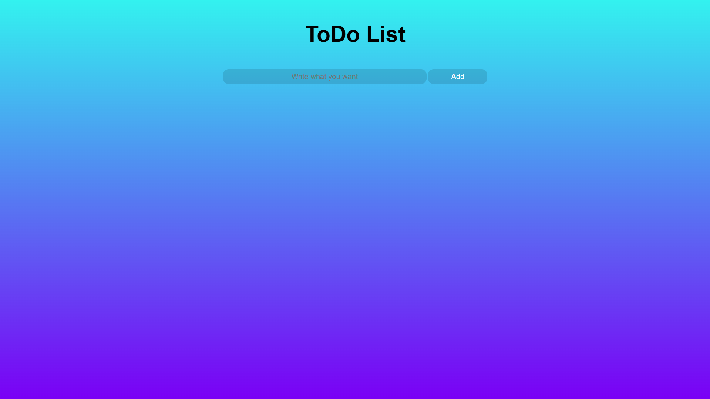

# ✅ Simple Todo App

<div align="center">
  


### 🎯 A beautiful and simple application to manage your daily tasks



</div>

---

## ✨ Features

### Core Features
- ✅ **Add new tasks** - With max 35 characters limit
- ✅ **Mark tasks as done** - Click on the button
- ✅ **Delete tasks** - Click again after completion
- ✅ **Auto-save** - Using browser localStorage
- ✅ **Enter key support** - Press Enter to add tasks quickly
- ✅ **Smart sorting** - Incomplete tasks appear first

### UI/UX Features
- 🎨 **Beautiful UI** - With smooth animations and hover effects
- 👆 **Blinking buttons** - Visual feedback on mouse hover
- 🌙 **Empty state design** - Beautiful message when no tasks exist
- 📱 **Responsive design** - Works on all devices

## 🎨 Button States

| State | Button Text | Color | Action |
|-------|-------------|-------|--------|
| Not Completed | `Not Done` | 🟡 Yellow | Marks as done |
| Completed | `Done` | 🟢 Green | Deletes task |
| Hover (Not Done) | `Done?` | 🟢 Green | Visual feedback |
| Hover (Done) | `Delete?` | 🔴 Red | Visual feedback |

## 🚀 Quick Start

### Option 1: Run Locally
```bash
# Clone the repository
git clone https://github.com/MrAvatar0/Simple-ToDo.git

# Navigate to project folder
cd Simple-ToDo

# Open index.html in your browser
start index.html  # Windows
open index.html   # Mac
```

## 💻 Technologies Used


## 🎮 How It Works

### 1. **➕ Add a task**
   - Type in the input box
   - Click "Add" button **OR** press **Enter** key
   - Task appears in the list with yellow button

### 2. **✅ Complete a task**
   - Click the yellow "Not Done" button
   - Button turns green and text changes to "Done"
   - Task moves to completed section

### 3. **🗑️ Delete a task**
   - Click the green "Done" button
   - Task is permanently removed
   - Confirmation notification appears

### 4. **🖱️ Hover effects**
   - Move mouse over buttons to see color changes
   - Buttons blink for better visual feedback

### 5. **🗑️ Delete all tasks**
   - Click "Delete All" button at the bottom
   - Confirmation dialog prevents accidents
   - All tasks removed at once

## 🗂️ Project Structure

```
Simple-ToDo/
│
├── 📄 index.html          # Main HTML file
├── 📄 style.css           # Styles and animations
├── 📄 script.js           # JavaScript functionality
├── 📄 README.md           # Documentation
│
└──  📁 screenshots/        # Screenshot images
    └── main.png
```
## 🤝 Contributing

Contributions are what make the open source community such an amazing place to learn, inspire, and create. Any contributions you make are **greatly appreciated**.

### How to contribute:

1. 🍴 Fork the repository
2. 🌿 Create a feature branch (`git checkout -b feature/AmazingFeature`)
3. 💾 Commit your changes (`git commit -m 'Add some AmazingFeature'`)
4. 📤 Push to the branch (`git push origin feature/AmazingFeature`)
5. 🔍 Open a Pull Request

## 🐛 Bug Reports

Found a bug? Please open an issue with:
- Description of the bug
- Steps to reproduce
- Expected behavior
- Screenshots (if applicable)

## 📞 Contact & Social

<div align="center">
  
[](https://github.com/MrAvatar0)

</div>

## 📜 License

This project is licensed under the MIT License - see the [LICENSE](./LICENSE) file for details.

---

<div align="center">
  
### ⭐ Star this project on GitHub — it helps!

**Made with ❤️ and JavaScript by [Avatar](https://github.com/MrAvatar0)**

[](https://forthebadge.com)
[](https://forthebadge.com)

</div>